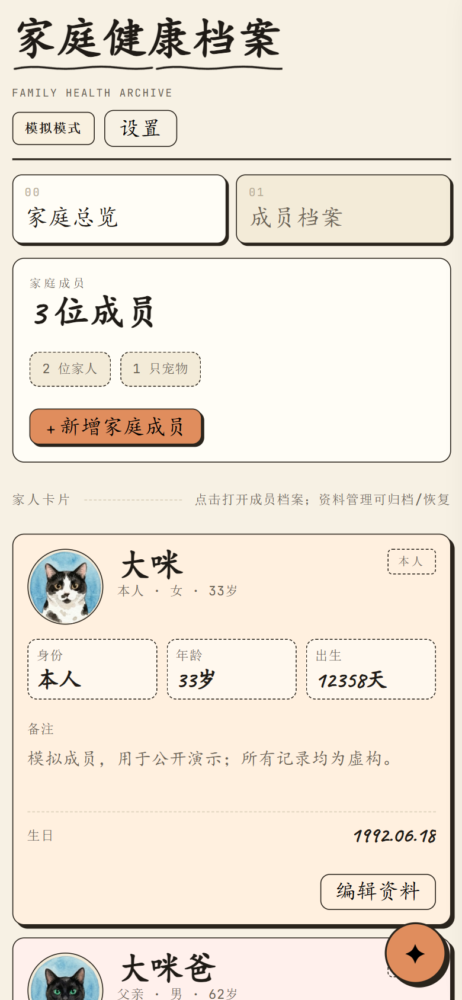
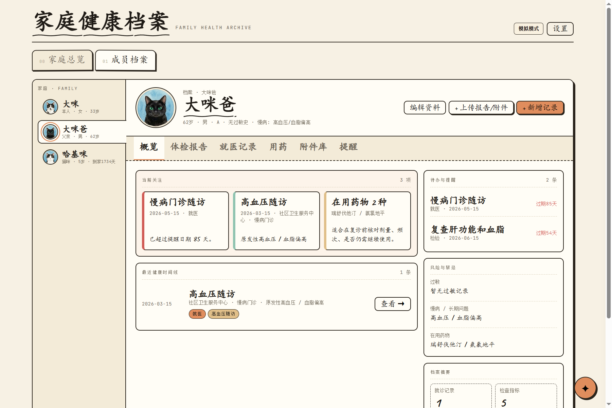
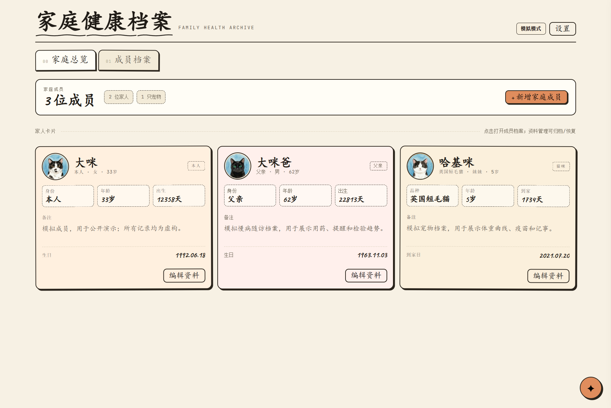
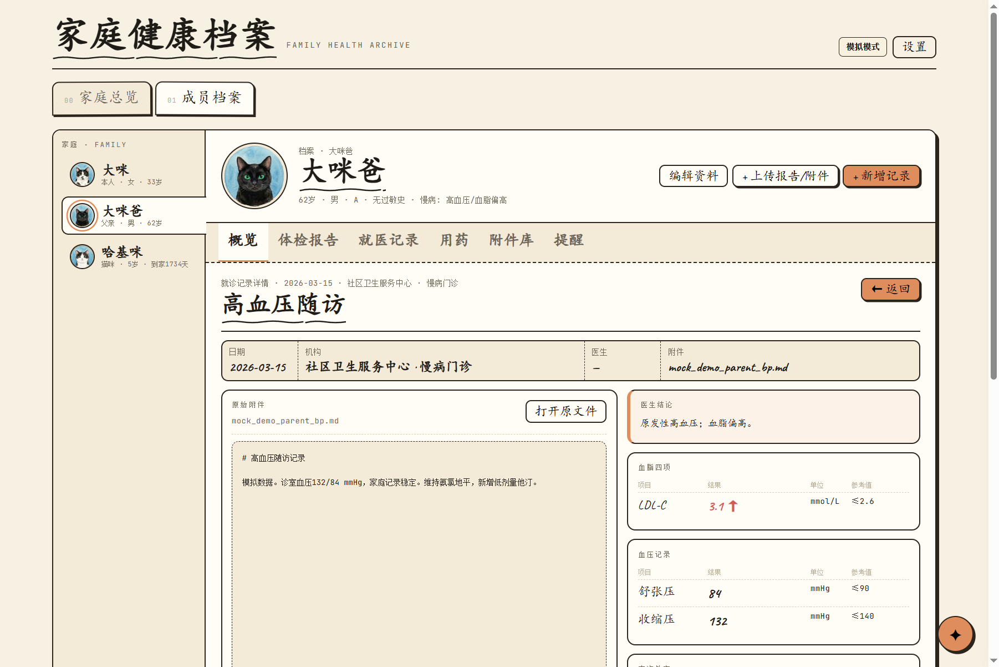
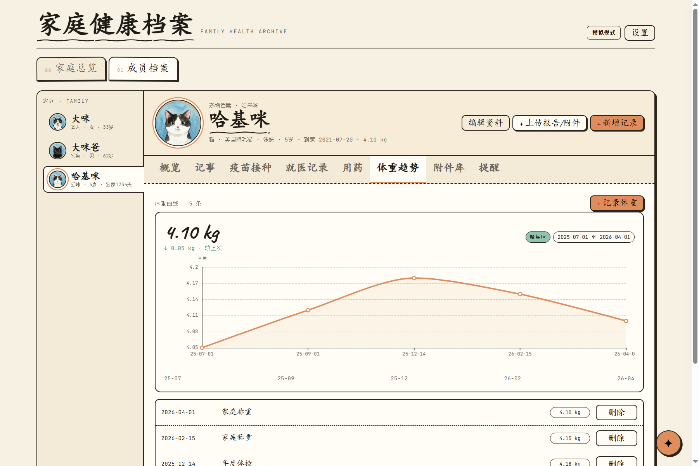
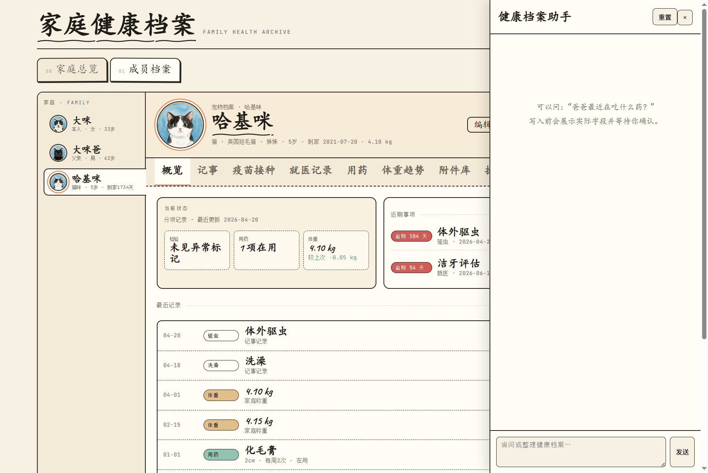

# 🏠 家庭健康档案

> 这不是医疗诊断工具。紧急或专业医疗问题请联系医生或当地急救服务。

**你是否——**

翻遍手机相册和微信聊天记录，只为找一份去年的体检报告？

每次陪家人去医院，都像在考记忆力：上次的化验结果、最近的用药变化，话到嘴边就是说不清？

攒了一抽屉的体检单，但真正被整理、被看懂的，没有几份？

---

全家人的健康记忆，散落在不同医院的 App、邮箱附件、微信聊天和落灰的文件袋里。每一次「我记得好像查过」的背后，都是一场翻找和回忆的消耗战。

更麻烦的是——体检报告越来越厚，几十项指标密密麻麻。想手动整理，光是把异常值挑出来、按人归档、对照上一次结果看趋势，就要花掉一个下午。

**你需要的不是再多一个云笔记，而是一个真正帮你把报告「吃进去、理清楚」的助手。**

---

## 上传一份报告，剩下交给它

**Health-Vault** 是一套跑在你自家电脑上的家庭健康档案。它的核心流水线很简单：

| 步骤 | 你做什么 | 它做什么 |
|------|----------|----------|
| 📤 **上传** | 拖拽一份体检 PDF，完事 | — |
| 🤖 **解析** | — | AI 自动读取每项指标、日期、参考范围 |
| 📁 **归档** | — | 归到对应家人名下，趋势图自动续上 |
| ✅ **确认** | 看一眼，点确认 | 写入前自动备份数据库 |

一份报告从上传到归档，AI 跑完整条流水线。你只需要最后核对一下——就像签收快递前看一眼包裹。

不只是体检报告：就诊记录、用药变化、体重趋势、疫苗接种……全家人的健康轨迹，包括毛孩子的，都在同一个地方，一目了然。

---

## 你的数据，留在你手里

| 🏠 **默认本地** | 数据库、报告、附件全部存在你自己的电脑上。不开 AI 功能，数据寸步不离你的硬盘。 |
|---|---|
| 🤖 **AI 功能涉及外发** | 使用 AI 解析报告或对话时，报告文本和图片会发往你在应用中配置的第三方模型服务。 |
| 🔑 **由你选择和控制** | 用什么模型服务、是否启用 AI，完全由你决定。只要你不配置，它就不会发。 |

---

## 三分钟跑起来

把下面这段话复制给你手边的编码 Agent（Claude Code、Codex 等），它会帮你搞定一切：

```text
请帮我在这台电脑上部署并启动「家庭健康档案」项目。

项目目录：<填写本仓库的本地路径>

请先完整阅读 README.md、AGENTS.md 和 docs/SETUP.md，然后：
1. 检查 Node.js 是否为 22.19+、Python 是否为 3.10+；缺少依赖时说明需要我安装什么，不要静默下载不明软件。
2. 在项目目录安装 npm 和 Python 依赖，并创建项目专用的 Python 虚拟环境。
3. 询问我设置一个非空的家庭共享密码；不要在聊天记录、日志、代码或 Git 中输出、保存或提交该密码。
4. 使用 `npm start` 启动完整服务，并确认我能在本机通过 http://127.0.0.1:8000/ 登录。
5. 询问我是否需要配置 Tailscale 手机访问。只有我明确同意且电脑存在有效的 Tailscale 100.x 地址时才配置；绝不使用 0.0.0.0、端口映射或公共互联网暴露。
6. 说明数据目录、备份方式和停止服务的方法。不要读取、上传、删除、重建或批量修改任何真实健康数据。

每一步先说明将执行的操作；遇到不确定项、密码、成员身份、日期、单位或真实健康数据时暂停并问我。
```

完整安装、Tailscale、开机自启、备份、升级、恢复与故障排查，请阅读 [安装与维护指南](docs/SETUP.md)。

## 界面预览

以下均为**虚构的模拟数据**，仅用于展示界面；不包含任何真实健康档案或报告。

| 家庭成员与手机访问 | 成员档案概览 |
| --- | --- |
|  |  |

| 家庭概览 | 就诊记录详情 |
| --- | --- |
|  |  |

| 宠物体重趋势 | 健康助手 |
| --- | --- |
|  |  |

## 核心功能

- 🧑‍⚕️ **全家成员档案**：为家人和毛孩子建立档案，健康摘要、就诊记录、体重趋势、用药、提醒和附件集中查看
- 📄 **AI 流水线解析**：上传体检报告 PDF 或图片，AI 自动提取指标、按人归档、续上趋势图——你只需核对确认
- 📈 **指标趋势追踪**：检验指标随时间的变化一目了然，异常项高亮，不用再手动对比几次报告
- 📱 **手机也能看**：在受信任的同一 Tailscale 网络中，用手机浏览器就能查看同一份档案，陪家人去医院随时调出来
- 🛡️ **写入即备份**：每次写入数据前自动创建 SQLite 数据库备份，改错了随时回滚

## 隐私与 AI

### 🏠 默认：数据留在本地

健康档案、SQLite 数据库、报告和附件默认保存在运行应用的电脑上，不会由本应用自动上传到云端。项目的 `data/` 目录是私有运行数据，已整体排除在 Git 版本控制之外。**不开 AI 功能，就没有数据外发。**

### 🤖 当你使用 AI 功能时

健康助手对话和「AI 解析报告」是可选功能。启用后：

- 你发送给助手的消息，以及用于解析的**报告文本、图片和已选成员信息**，会发送给你在应用中配置的第三方 AI 模型服务。
- 请在使用前自行确认所选模型服务的**隐私政策、数据保留政策、适用地区和费用**。
- 不要在上传的报告或对话中包含他人的健康信息，除非你已获得明确授权。

### 🔑 控制权在你手里

模型服务由你自行选择和配置。不配置，AI 功能就不会发送任何数据。配置了，也可以随时更换或关闭。

## 快速开始

> 💡 想一步到位？把[上面的 Agent 提示词](#三分钟跑起来)复制给编码助手，它会自动帮你部署。

如果你更习惯手动操作，开发运行需要 Node.js 22.19+、Python 和后端依赖：

```powershell
npm install
python -m pip install -r backend\requirements.txt
$env:HEALTH_APP_PASSWORD = "设置家庭密码"
npm start
```

常用验证：

```powershell
npm run check
npm test
npm run smoke
```

`npm start` 会先编译 `agent-runtime/` 到 `dist-server/`，再启动 Python 服务；FastAPI 会拉起 loopback Agent runtime。不要跳过编译后直接把 FastAPI 当成完整服务运行。

开机自启脚本必须使用这一入口，并要求用户级环境变量已包含 `HEALTH_APP_PASSWORD`。构建 `dist/`、Electron 安装包和 PyInstaller sidecar 均不再是本项目流程。

完整安装、Tailscale、开机自启、备份、升级、恢复与故障排查，请阅读 [安装与维护指南](docs/SETUP.md)。

## 开源许可

本项目采用 [GNU AGPLv3](LICENSE) 许可。若你修改本项目并通过网络向他人提供服务，需向相应用户提供修改后的完整源代码。

## 安全边界

- 默认仅监听 `127.0.0.1`；网页设置只能绑定检测到的 Tailscale IP，不会绑定所有网卡。
- 所有页面、静态资源和 API 都要求登录；会话 Cookie 为 HttpOnly、Strict SameSite。
- Node 健康助手仅监听 loopback，由 FastAPI 在鉴权后代理。
- 不要配置路由器端口映射、公共反向代理或公共互联网暴露。
- 数据库备份不包含附件和报告；请按维护指南备份整个数据目录到加密的异盘位置。
