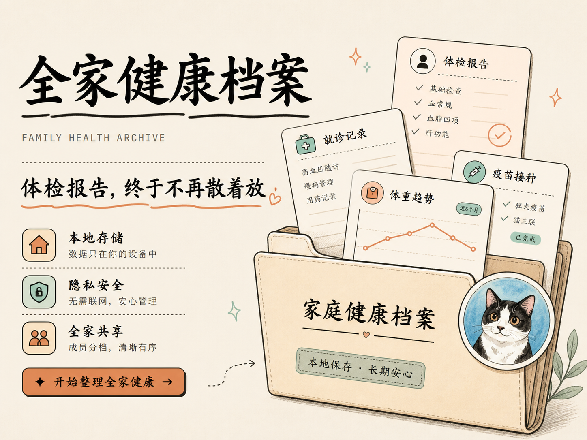

# 🏠 家庭健康档案

> 这不是医疗诊断工具。紧急或专业医疗问题请联系医生或当地急救服务。

**你是否——**

翻遍手机相册和微信聊天记录，只为找一份去年的体检报告？

每次陪家人去医院，都像在考记忆力：上次的化验结果、最近的用药变化，话到嘴边就是说不清？

攒了一抽屉的体检单，但真正被整理、被看懂的，没有几份？

---

全家人的健康记忆，散落在不同医院的 App、邮箱附件、微信聊天和落灰的文件袋里。每一次「我记得好像查过」的背后，都是一场翻找和回忆的消耗战。

更麻烦的是——体检报告越来越厚，几十项指标密密麻麻。想手动整理，光是把异常值挑出来、按人归档、对照上一次结果看趋势，就要花掉一个下午。

**你需要的不是再多一个云笔记，而是一个真正帮你把报告「吃进去、理清楚」的助手。**

---

## 报告丢进文件夹，剩下交给它

**Health-Vault** 是一套跑在你自家电脑上的家庭健康档案。它的核心流水线很简单：

| 步骤 | 你做什么 | 它做什么 |
|------|----------|----------|
| 📥 **放进收件箱** | 把体检 PDF 或扫描件放进 `incoming/` | — |
| 💬 **说一句话** | 在项目目录里跑 `pi`，说“处理 incoming 里的报告” | 读报告、看原图、识别受检者与指标 |
| 📁 **归档** | — | 归到对应家人名下，趋势图自动续上 |
| ✅ **确认** | 看一眼字段摘要，说“写入” | 写入前自动备份数据库，写完回报 `visit_id` 与备份路径 |

一份报告从收件箱到归档，助手跑完整条流水线，并且只在你确认后才写库。

不只是体检报告：就诊记录、用药变化、体重趋势、疫苗接种……全家人的健康轨迹，包括毛孩子的，都在同一个地方，一目了然。

---

## 你的数据，留在你手里

| 🏠 **默认本地** | 数据库、报告、附件全部存在你自己的电脑上。不开 AI 功能，数据寸步不离你的硬盘。 |
|---|---|
| 🤖 **AI 功能涉及外发** | 使用 AI 解析报告或对话时，报告文本、扫描件原图会发往你本机 `pi` 登录的模型服务。 |
| 🔑 **由你选择和控制** | 模型服务由本机 `pi`（`pi login` / `pi --list-models`）决定；不登录，AI 功能就不会发送任何数据。 |

---

## 三分钟跑起来

把下面这段话复制给你手边的编码 Agent（Claude Code、Codex 等），它会帮你搞定一切：

```text
请帮我在这台电脑上部署并启动「家庭健康档案」项目。

项目目录：<填写本仓库的本地路径>

请先完整阅读 README.md、AGENTS.md 和 docs/SETUP.md，然后：
1. 检查 Node.js 是否为 22.19+、Python 是否为 3.10+；缺少依赖时说明需要我安装什么，不要静默下载不明软件。
2. 在项目目录安装 npm 和 Python 依赖，并创建项目专用的 Python 虚拟环境。
3. 确认我不会把服务暴露到本机以外：本版本没有登录鉴权，只允许监听 127.0.0.1。
4. 使用 `npm start` 启动完整服务，并确认我能在本机直接打开 http://127.0.0.1:8000/（不需要密码）。
5. 询问我是否需要配置 Tailscale 手机访问（注：当前版本远程访问已停用，默认仅本机 `127.0.0.1`；除非我明确要求恢复，否则不要配置）。绝不使用 0.0.0.0、端口映射或公共互联网暴露。
6. 说明数据目录、备份方式和停止服务的方法。不要读取、上传、删除、重建或批量修改任何真实健康数据。

每一步先说明将执行的操作；遇到不确定项、成员身份、日期、单位或真实健康数据时暂停并问我。
```

完整安装、Tailscale、开机自启、备份、升级、恢复与故障排查，请阅读 [安装与维护指南](docs/SETUP.md)。

## 界面预览

以下均为**虚构的模拟数据**，仅用于展示界面；不包含任何真实健康档案或报告。

| 家庭成员与手机访问 | 成员档案概览 |
| --- | --- |
|  |  |

| 家庭概览 | 就诊记录详情 |
| --- | --- |
|  |  |

| 宠物体重趋势 |
| --- |
|  |

| 应用界面（模拟数据） |
| --- |
|  |

## 核心功能

- 🧑‍⚕️ **全家成员档案**：为家人和毛孩子建立档案，健康摘要、就诊记录、体重趋势、用药、提醒和附件集中查看
- 📄 **终端助手导入报告**：把报告丢进 `incoming/`，用项目里的 `pi` 说一句“处理 incoming 里的报告”，它读明刻/原图、归档、校验、等你确认后写库（自带备份）
- 🤖 **终端助手读数**：在项目目录跑 `pi` 可读家庭成员、就诊、指标趋势、用药、提醒、附件，也能检索历史报告原文；批量写库必须先给你看 dry-run 并经你确认
- 📈 **指标趋势追踪**：检验指标随时间的变化一目了然，异常项高亮，不用再手动对比几次报告
- ✍️ **前端小写入**：成员、记事/提醒、体重、用药单条维护可在界面直接操作（含二次确认）；报告批量导入只走终端 pi
- 📱 **手机也能看**（已停用）：远程访问入口当前已隐藏，仅支持本机访问；Tailscale 检测代码保留以便将来恢复
- 🛡️ **批量写入即备份**：`import_visit_json.py --write` 前自动创建 SQLite 时间戳备份，写错用备份恢复；前端单条小写入不触发自动备份

## 隐私与 AI

### 🏠 默认：数据留在本地

健康档案、SQLite 数据库、报告和附件默认保存在运行应用的电脑上，不会由本应用自动上传到云端。项目的 `data/` 目录是私有运行数据，已整体排除在 Git 版本控制之外。**不登录模型服务，就没有数据外发。**

### 🤖 当你使用 AI 功能时

终端报告导入与终端问答是可选功能（网页内无 AI 助手）。启用后：

- 导入报告时，原始文件会先发给 MinerU 服务转换为 Markdown；你在终端向助手提问时，该 **Markdown、扫描件原图与相关记录**会发送给你本机 `pi` 登录的模型服务。
- 请在使用前自行确认所选模型服务的**隐私政策、数据保留政策、适用地区和费用**。
- 终端助手可以读取化验指标、就诊记录和历史报告文件；批量写库必须先给你看 dry-run 并经你确认后才 `--write`。前端小写入是你本人点击确认的操作，不经过 AI。
- 不要在报告或对话中包含他人的健康信息，除非你已获得明确授权。

### 🔑 控制权在你手里

模型服务由本机 `pi` 决定：换了账号或模型，终端导入与问答跟着换；`pi` 没登录时终端助手与解析会直接报错，而不是另一个地方再要求你填一份密钥。

## 快速开始

> 💡 想一步到位？把[上面的 Agent 提示词](#三分钟跑起来)复制给编码助手，它会自动帮你部署。

如果你更习惯手动操作，开发运行需要 Node.js 22.19+、Python 和后端依赖：

```powershell
npm install
python -m pip install -r backend\requirements.txt
npm start
```

打开 <http://127.0.0.1:8000/>：**不需要密码、不需要配置任何环境变量**。服务只监听 `127.0.0.1`，绑定到其他地址会拒绝启动。

常用验证：

```powershell
npm test
npm run smoke
```

`npm start` 会启动 Python 服务（FastAPI）。报告解析与问答走本机终端 `pi` + skill，不由 FastAPI 调用 `pi` CLI。

开机自启脚本必须使用这一入口，且不需要任何环境变量。构建 `dist/`、Electron 安装包和 PyInstaller sidecar 均不再是本项目流程。

完整安装、Tailscale、开机自启、备份、升级、恢复与故障排查，请阅读 [安装与维护指南](docs/SETUP.md)。

## 开源许可

本项目采用 [GNU AGPLv3](LICENSE) 许可。若你修改本项目并通过网络向他人提供服务，需向相应用户提供修改后的完整源代码。

## 安全边界

- 默认仅监听 `127.0.0.1`；远程访问（Tailscale）已停用，设置页入口隐藏、开远程接口直接拒绝。
- **没有登录鉴权**：只允许监听 `127.0.0.1`，绑定其他地址直接拒绝启动；同机上运行的其他程序可以读写这份健康档案。
- 终端 `pi` 的模型与登录由你本机控制，应用不保存任何 API Key。
- 不要配置路由器端口映射、公共反向代理或公共互联网暴露。
- 数据库备份不包含附件和报告；请按维护指南备份整个数据目录到加密的异盘位置。
