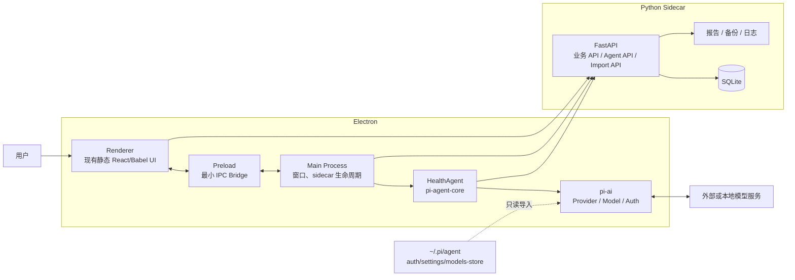
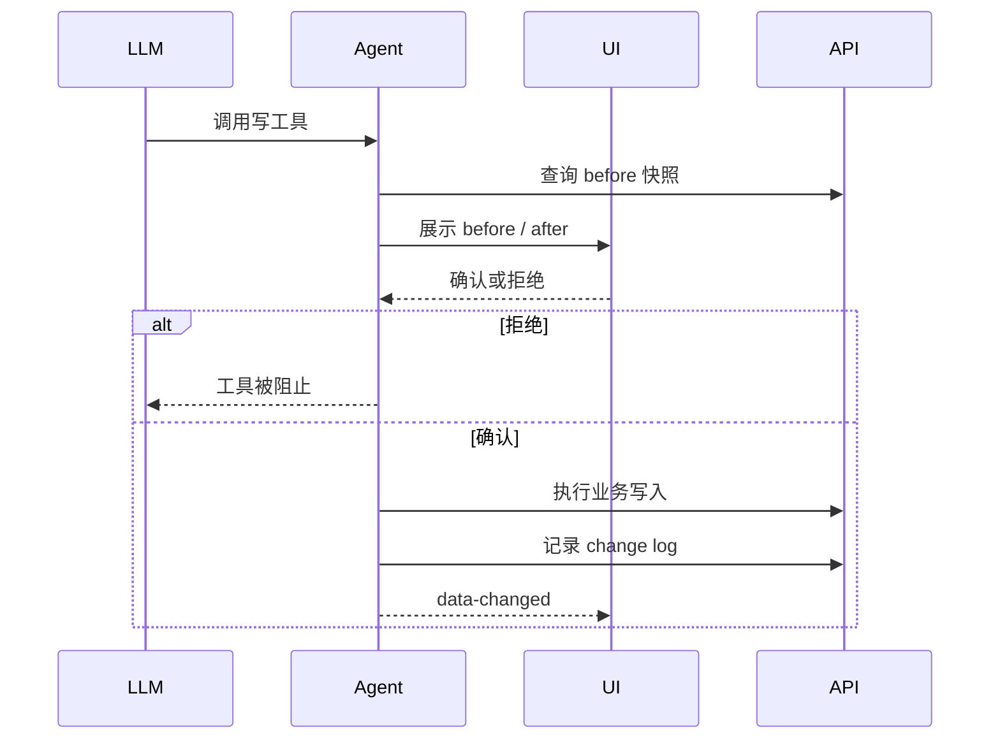
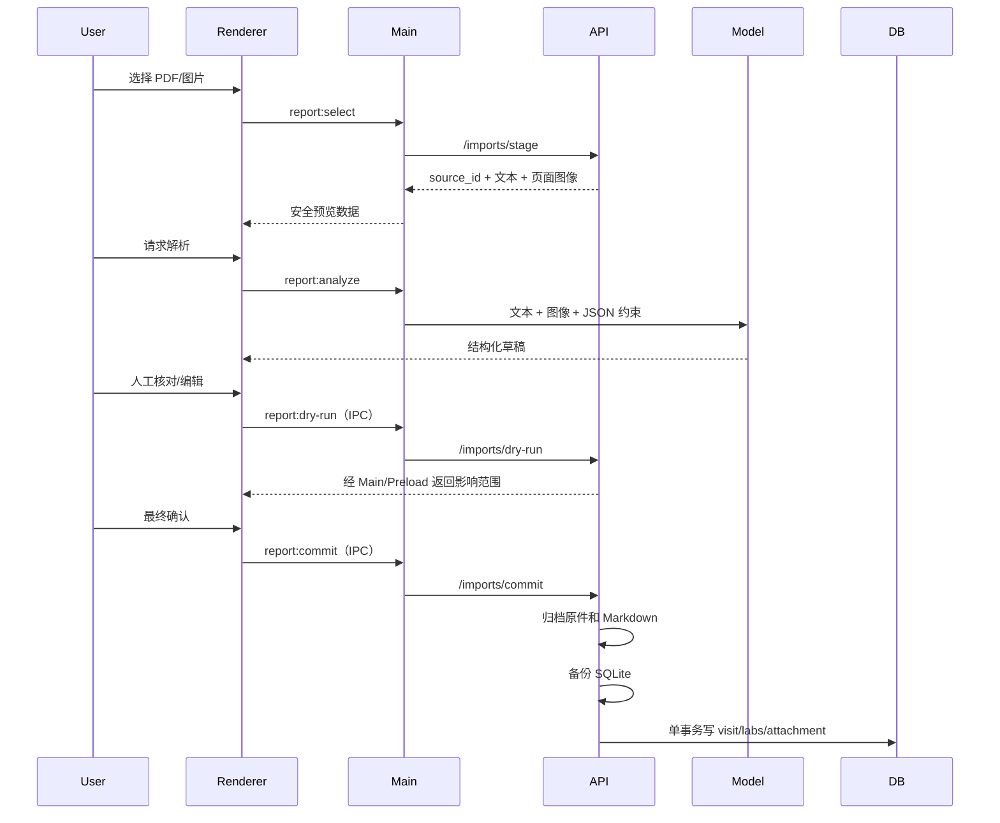
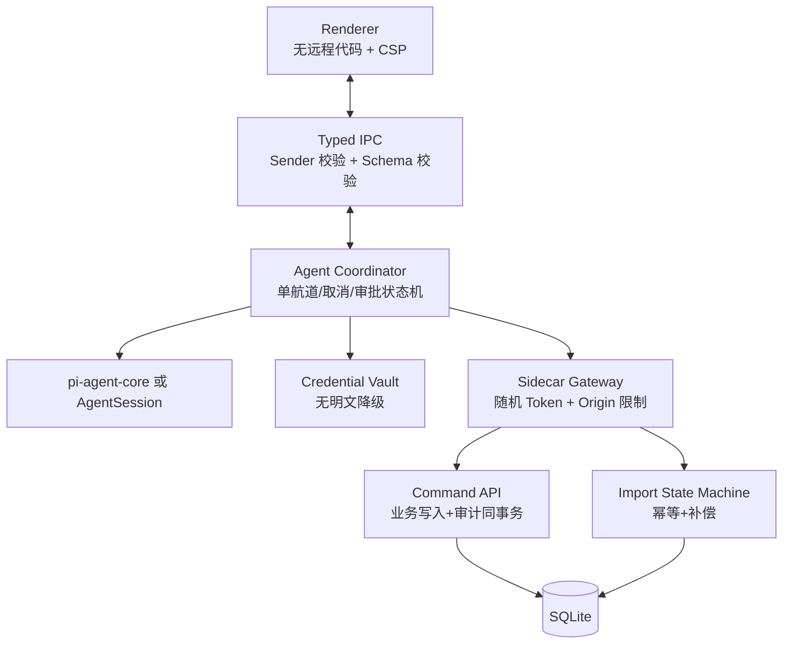
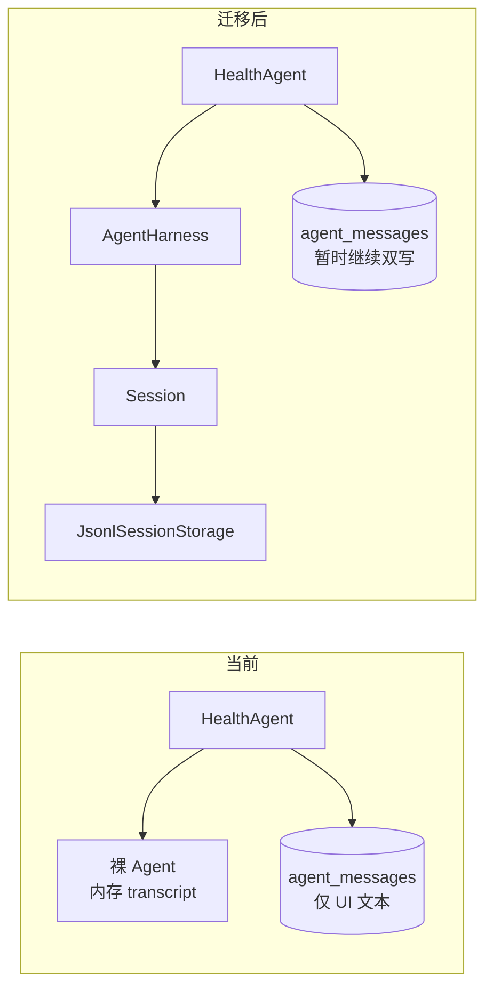
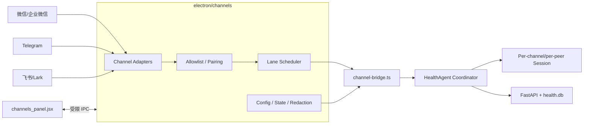

# 从 Web 应用到 Electron + Pi Agent：开发与改造指南

> 基于 Health Vault 当前工作区相对 `HEAD e2f2c2e` 的改造复盘。
> 编写日期：2026-08-03。
> 目标读者：后续需要把现有 Web/本地应用改造成 Electron-Agent 桌面应用的开发者与 AI coding agent。

## 1. 文档范围与结论

本文分析同时覆盖：

1. `git diff` 中已跟踪文件的修改；
2. `git status` 中尚未跟踪、但属于本次实现主体的新文件；
3. 当前代码、测试与打包配置；
4. Pi SDK、`pi-agent-core`、`pi-ai` 的相关设计约束。

注意：单独运行 `git diff` **看不到未跟踪文件**。本次最关键的 `electron/agent.ts`、`electron/main.ts`、`backend/routers/agent.py`、`backend/routers/imports.py`、`package.json` 和测试均属于未跟踪文件，因此复盘类似改造时必须把以下命令结合使用：

```bash
git status --short
git diff --stat
git diff --name-status
git diff
git ls-files --others --exclude-standard
```

### 1.1 一句话结论

本次改造采用的是：

> **Electron 主进程托管 Python/FastAPI sidecar，并在主进程内嵌低权限 `pi-agent-core` Agent；Renderer 只通过 preload IPC 使用 Agent 能力，Agent 只通过受限 HTTP 工具访问业务 API。**

这是一个适合单用户、本地优先、已有 Web 前后端的桌面 Agent 架构。其核心价值不是“把聊天框放进 Electron”，而是建立了四层边界：

- Renderer 不获得 Node.js 能力；
- Agent 不获得 shell、文件系统、Git 等通用工具；
- 业务写入仍经过 FastAPI/Pydantic；
- 高风险写操作增加审批、快照和撤销机制。

### 1.2 当前实现状态

| 能力 | 当前状态 | 主要入口 |
| --- | --- | --- |
| Electron 桌面壳 | 已实现 | `electron/main.ts`、`electron/preload.cts` |
| Python sidecar 启停 | 已实现 | `electron/main.ts`、`backend/run_backend.py` |
| Windows 打包 | 已配置 | `package.json`、`health-vault-backend.spec` |
| 内置健康 Agent | 已实现 | `electron/agent.ts` |
| 多 Provider / OAuth / API Key | 已接入 | `pi-ai` + 自定义凭据存储 |
| 只读健康工具 | 已实现 | `HealthAgent.tools()` |
| 写工具审批 | 已实现基础版本 | `beforeToolCall` + Renderer 确认弹窗 |
| 写入变更日志与 `/undo` | 已实现基础版本 | `backend/routers/agent.py` |
| PDF/图片报告导入 | 已实现 | `backend/routers/imports.py`、`report_import.jsx` |
| 单元测试 | 已实现基础覆盖 | `tests/test_*.py` |
| Electron smoke test | 已实现 | `tests/electron-smoke.mjs` |
| 成员初始化与归档 | 已实现 | `member_editor.jsx`、`backend/routers/members.py` |
| `AgentHarness` 持久会话迁移 | 已规划、未实现 | 见 11.2 节 |
| 微信/Telegram/飞书渠道 | 已规划、未实现 | 见 11.3 节 |
| 跨平台安装包 | 未实现 | 当前仅 Windows NSIS + `.exe` sidecar |
| 安全收口与生产加固 | 部分完成 | 见第 9 节 |

---

## 2. 改造后的总体架构



### 2.1 进程职责

#### Electron Main Process

负责：

- 分配 loopback 动态端口；
- 启动、探活、停止 Python sidecar；
- 创建安全配置的 `BrowserWindow`；
- 初始化模型、凭据和 `HealthAgent`；
- 承接 Renderer IPC；
- 处理本地文件选择；
- 将 Agent 流式事件发送给 Renderer。

主要文件：`electron/main.ts`。

#### Renderer

负责：

- 业务页面；
- 无需模型即可完成的成员创建、编辑、归档与恢复；
- Agent 对话 UI；
- 模型设置 UI；
- 写操作 before/after 审批；
- 报告导入草稿核对、dry-run 和最终确认。

Renderer 不直接读取凭据，也不直接调用模型 SDK。

#### Python Sidecar

负责：

- 继续承载原有业务 API；
- 提供 Agent 所需的受控 CRUD；
- 记录对话与变更快照；
- 执行 `/undo`；
- 暂存、解析、归档报告；
- dry-run、数据库备份与事务写入。

#### Pi Agent / Model Layer

- `@earendil-works/pi-agent-core`：Agent 循环、工具执行、事件流、取消、`beforeToolCall`；
- `@earendil-works/pi-ai`：Provider、模型目录、API Key/OAuth、视觉输入、统一调用接口；
- `typebox`：工具参数 JSON Schema。

---

## 3. 为什么使用 `pi-agent-core`，而不是完整 `pi-coding-agent`

本项目有意使用低层 `Agent`：

```ts
new Agent({
  initialState: { systemPrompt, model, tools },
  streamFn: models.streamSimple.bind(models),
  toolExecution: "sequential",
  beforeToolCall: confirmWrite,
});
```

这与完整 Pi Coding Agent SDK 的 `createAgentSession()` 路线不同。

### 3.1 当前选择适用的场景

当应用需要：

- 固定领域 Agent；
- 严格白名单工具；
- 不允许 shell、文件系统、Git；
- 自己管理 UI、历史记录和审批；
- 不需要向用户暴露 skills、extensions、prompt templates；

优先选择 `pi-agent-core` + `pi-ai`。

### 3.2 何时应改用 `createAgentSession()`

完整 Pi SDK 更适合：

- 需要持久化 Agent 会话树、fork、resume、compaction；
- 需要 Pi skills、extensions、上下文文件和 prompt templates；
- 需要内置 read/bash/edit/write 等 coding tools；
- 需要 `AgentSessionRuntime` 的会话替换能力；
- 需要复用 Pi 的完整资源发现与设置合并逻辑。

### 3.3 选型矩阵

| 需求 | `pi-agent-core` | `pi-coding-agent` SDK | Pi RPC 子进程 |
| --- | --- | --- | --- |
| 同一 Node/Electron 进程内嵌 | 最轻 | 支持 | 否 |
| 固定领域工具 | 最合适 | 支持但较重 | 支持 |
| 完整 Pi 会话与资源系统 | 需自建 | 原生支持 | 原生支持 |
| 进程隔离 | 无 | 无 | 有 |
| 跨语言接入 | 不适合 | 不适合 | 合适 |
| 最小能力面 | 最容易 | 需显式裁剪 | 取决于启动参数 |

本项目的 Agent 不具备通用 coding 能力，因此“工具白名单 + 业务 API”比“完整 Pi 运行时再禁用工具”更直接。

---

## 4. Electron 桌面化改造

### 4.1 动态端口与 sidecar 启动

`electron/main.ts` 的启动流程：

1. 在 `127.0.0.1:0` 请求空闲端口；
2. 开发模式启动 `python backend/run_backend.py`；
3. 打包模式启动 `resources/backend/health-vault-backend.exe`；
4. 注入数据、前端和公共资源路径环境变量；
5. 轮询 `/api/meta`，确认 sidecar 就绪；
6. `BrowserWindow.loadURL(baseUrl)`。

关键环境变量：

| 变量 | 用途 |
| --- | --- |
| `HEALTH_PORT` | sidecar 监听端口 |
| `HEALTH_VAULT_HOME` | 数据根目录 |
| `HEALTH_FRONTEND_DIR` | 前端静态文件目录 |
| `HEALTH_PUBLIC_DIR` | 公共资源目录 |
| `HEALTH_DB_PATH` | 测试或显式覆盖数据库路径 |
| `HEALTH_MOCK_MODE` | smoke test 使用 mock 数据 |
| `HEALTH_PYTHON` | 开发时覆盖 Python 可执行文件 |

#### 可复用模式

把“安装目录中的只读资源”和“用户可写数据”彻底分开：

```text
安装资源：process.resourcesPath
用户数据：app.getPath("userData")
```

开发模式可继续使用项目目录，安装版必须使用 `userData`：

```text
<userData>/data/health.db
<userData>/data/reports/
<userData>/data/backups/
<userData>/data/log/
<userData>/agent-credentials.bin
<userData>/agent-settings.json
```

这是桌面应用升级、重装不丢数据的关键。

### 4.2 BrowserWindow 安全基线

当前已启用：

```ts
webPreferences: {
  preload,
  contextIsolation: true,
  nodeIntegration: false,
  sandbox: true,
}
```

这是 Electron-Agent 应用的最低基线。不要因为 Renderer 需要调用 Agent 就关闭隔离；应通过 preload 暴露窄接口。

### 4.3 Preload Bridge

`electron/preload.cts` 只暴露两个命名空间：

- `window.healthAgent`
- `window.healthReport`

通过 preload，Renderer 看不到：

- `ipcRenderer` 本体；
- 文件系统；
- Electron `app`；
- 凭据文件路径；
- 通用 HTTP 代理或可由 IPC 指定的 backend URL；
- 任意工具注册入口。

但 Renderer 仍然具有浏览器原生网络能力（例如 `fetch`），当前还会加载外部 CDN。preload 的窄接口不能替代 CSP、sidecar token、Origin 与 IPC sender 校验。

推荐继续保持“一项用户能力对应一个明确 IPC 方法”，不要暴露通用的：

```ts
invoke(channel: string, payload: unknown)
```

### 4.4 打包链路

```text
TypeScript
  -> dist-electron/
Python + FastAPI
  -> PyInstaller 单文件 sidecar
Electron resources
  -> frontend/ + public/ + sidecar
Electron Builder
  -> Windows NSIS 安装包
```

主要配置：

- `package.json`
- `tsconfig.json`
- `health-vault-backend.spec`
- `backend/requirements-build.txt`

版本固定 `pi-agent-core` 与 `pi-ai` 为同一版本，可避免核心事件/API 类型不一致。

---

## 5. Pi Agent 集成

### 5.1 模型集合

当前使用：

```ts
builtinModels({ credentials, modelsStore })
```

这会注册 `pi-ai` 的全部内置 Provider。随后：

```ts
await models.refresh({ allowNetwork: false });
```

只恢复本地缓存，不在应用启动时主动联网刷新动态模型目录。

#### 当前配置来源优先级

1. 桌面应用显式保存且仍有效的 provider/model；
2. Pi `~/.pi/agent/settings.json` 的默认 provider/model；
3. 桌面历史设置；
4. 代码内默认值。

模型缓存从 `~/.pi/agent/models-store.json` 只读恢复；Pi 配置不会被桌面应用写回。

#### 重要边界

当前实现读取的是 Pi 内置模型缓存，并未完整加载 Pi Coding Agent 的 `models.json`、extensions、skills 或项目设置合并逻辑。不要把它描述成“完全复用 Pi 配置”。更准确的描述是：

> 桌面应用选择性导入 Pi 的凭据、默认模型与动态模型缓存。

### 5.2 凭据存储

`EncryptedCredentialStore` 实现 `pi-ai` 的 `CredentialStore` 接口，保存到 Electron `userData`，优先使用：

```ts
safeStorage.encryptString(...)
```

启动时会读取 `~/.pi/agent/auth.json`，把凭据复制进桌面应用自己的凭据库。之后 Pi 与桌面应用各自持有独立副本。

该模式的优点：

- 不修改 Pi 原始配置；
- 桌面应用卸载/迁移可独立处理；
- 模型 SDK 通过标准 `CredentialStore` 获取凭据；
- OAuth 刷新结果可落入应用自己的存储。

### 5.3 Agent 系统提示词

当前提示词集中约束：

- 只能依据工具返回的数据；
- 不得编造健康记录；
- 写操作必须走工具；
- 缺成员、日期、剂量、单位等信息时先询问；
- 不进行诊断；
- 紧急情况建议联系医生。

提示词是行为约束，不是安全边界。真正的安全边界必须由工具白名单、API 校验和审批钩子共同实现。

### 5.4 领域工具

工具大致分为：

#### 只读

- 成员；
- 就诊与详情；
- 化验与趋势；
- 用药；
- 体重；
- 提醒；
- 附件元数据与文本；
- 最近动态。

#### 写入

- 成员更新；
- 就诊增删改；
- 化验增删改；
- 用药增删改；
- 体重增删；
- 提醒增删改与跳过；
- 附件元数据增删改。

工具不直接操作 SQLite，而是请求 loopback FastAPI。这样 Pydantic 校验、外键/业务规则和前端接口可以复用。

### 5.5 写操作审批

Agent 使用 `beforeToolCall`：



设置 `toolExecution: "sequential"` 可避免多个写工具并发弹审批、快照顺序混乱以及 `/undo` 顺序不可预测。

### 5.6 对话事件流

主进程监听：

- `message_update/text_delta`：增量推送到 Renderer；
- `agent_end`：保存最终助手文本，发送 done；
- `agent.state.errorMessage`：传递错误状态。

Renderer 将增量合并为一条 streaming 消息，并提供停止按钮调用 `agent.abort()`。

### 5.7 对话持久化的实际语义

`agent_messages` 表保存 UI 可见的用户与助手文本，但当前并未把历史消息重新注入 `Agent.initialState.messages`。

因此当前效果是：

- UI 历史可跨启动查看；
- 同一次 `Agent` 实例内保留上下文；
- 重启应用或切换模型重建 `Agent` 后，模型上下文重新开始；
- 工具调用与工具结果也没有持久化到业务消息表。

后续必须明确产品语义：

1. 只把历史当审计/展示记录；或
2. 恢复完整 `AgentMessage[]`；或
3. 改用 `AgentSession` / `SessionManager`。

不要把“聊天文本已入库”等同于“Agent 会话已恢复”。

---

## 6. 报告导入链路

报告导入没有让聊天 Agent 自主决定写库，而是采用独立、可核对的工作流：



### 6.1 暂存与预览

当前限制：

- 最大 20 MB；
- 最多 8 页 PDF；
- 支持 PDF、PNG、JPG、JPEG、WEBP、BMP；
- PDF 每页渲染为 PNG；
- 图片缩放到最大 1800×1800；
- 暂存目录使用随机 32 位十六进制 `source_id`；
- 文件名使用 `Path(name).name` 去除目录穿越。

### 6.2 模型解析

`analyzeReport()`：

- 检查模型是否支持 image 输入；
- 将已确认成员传入提示词；
- 最多附加 12000 字符 PDF 文本；
- 请求纯 JSON；
- 对返回内容执行 `JSON.parse`；
- 不确定字段要求使用 `null`、`[]` 或 `unknown`。

### 6.3 人工核对与写入

Renderer 将模型结果作为可编辑 JSON 展示。只有：

1. JSON 可解析；
2. 至少存在报告日期；
3. 后端 Pydantic 校验通过；
4. dry-run 通过；
5. 用户再次确认；

才会 commit。

正式写入前创建 SQLite 备份，并把原件、Markdown 摘要、结构化数据库记录一起保存。这种“原始证据 + 结构化数据 + 备份路径”的组合很适合医疗、财务、合同等高审计需求场景。

---

## 7. 后端和数据库改造

### 7.1 可重定位数据根目录

`backend/database.py` 从固定项目路径改为：

```py
BASE_DIR = Path(os.getenv("HEALTH_VAULT_HOME", project_root)).resolve()
```

这是 Python sidecar 能在 Electron 安装版中运行的基础。

### 7.2 新增表

#### `agent_change_log`

保存：

- 工具名；
- 表名；
- 行 ID；
- create/update/delete；
- before/after JSON；
- 撤销时间；
- 创建时间。

#### `agent_messages`

保存：

- `session_id`；
- role；
- content；
- 创建时间。

### 7.3 补齐业务写接口与首次使用入口

本次为 visits、labs、attachments 补充了 POST/PATCH/DELETE，使 Agent 可以继续通过业务 API 工作，而不是绕过后端直写 SQLite。

当前 diff 还为成员增加了：

- `POST /api/members`；
- 安全 key 校验或自动生成；
- 重名 key 冲突处理；
- `archived_at` schema 迁移；
- 默认列表过滤已归档成员；
- 成员/宠物创建、编辑、归档与恢复 UI。

这是值得复用的产品边界：**首次建立成员身份不依赖模型，已有健康记录的成员不做级联删除，而采用可恢复归档。** Agent 后续处理报告和记录时才能基于用户已明确建立的成员身份工作。

### 7.4 `/undo`

基础策略：

| 原操作 | 撤销动作 |
| --- | --- |
| create | 删除对应行 |
| update | 使用 before 快照恢复整行 |
| delete | 使用 before 快照重新插入 |

这是可用的第一版，但不等价于通用事务回滚，限制见第 9 节。

### 7.5 数据库连接关闭

`LoggedConnection.__exit__()` 在提交/回滚和写日志后显式关闭连接，避免桌面长驻进程累计连接或文件句柄。

---

## 8. 测试与验证策略

当前提供三层验证：

### 8.1 TypeScript 静态检查

```powershell
npm run check
```

覆盖 Electron Main/Preload/Agent 类型。

### 8.2 Python 单元测试

```powershell
python -m unittest discover -s tests -v
```

当前只覆盖以下**基础成功路径**：

- 成员创建时安全 key 自动生成、显式 key 冲突与非法 key 拒绝；
- 成员归档/恢复过滤和旧数据库 `archived_at` 迁移；
- 后端 visit 更新、快照记录和撤销；
- lab 与 attachment 新增；
- 一页 PDF 暂存和图像预览；
- 报告 dry-run；
- 原件和 Markdown 归档；
- 数据库备份；
- 报告 commit 中 visit/lab/attachment 的成功写入。

尚未覆盖真实 Agent prompt/工具调用、审批拒绝、事务回滚、写入成功但 change log 失败、凭据同步和加密降级等失败路径。

### 8.3 Electron smoke test

```powershell
npm run smoke
```

测试使用：

- 临时 `user-data-dir`；
- mock 数据库；
- Electron remote debugging + CDP；
- Renderer 页面和 preload bridge 检查；
- Agent 设置/历史接口；
- 报告导入入口与弹窗。

### 8.4 本次文档编写时的验证结果

```text
npm run check                                      PASS
python -m unittest discover -s tests -v           PASS（7 tests）
npm run smoke                                      PASS
git diff --check                                   PASS
```

是否打包成功、安装后是否离线可运行、真实 OAuth 流程和真实模型调用，不应仅由上述测试推断，仍需单独验证。

---

## 9. 当前实现不应直接照搬的风险与技术债

以下不是对整体架构的否定，而是下一轮产品化前应收口的事项。

### 9.1 P0：写入与撤销不是同一事务

当前顺序是：

1. 业务 API 写入；
2. 另一次 API 请求记录 change log。

如果第 1 步成功、第 2 步失败，会出现“数据已改但不可撤销”。建议把：

- 业务写入；
- before/after 快照；
- change log；

放进同一后端事务，或提供专门的 Agent command endpoint。

### 9.2 P0：审批应采用默认拒绝，而不是工具名命中

当前只有出现在 `WRITE_SPECS` 的工具才触发审批。未来新增写工具却忘记登记时，可能绕过确认。

推荐：

- 每个工具显式声明 `risk: "read" | "write" | "destructive"`；
- 未分类工具默认阻止；
- 启动时断言所有写工具都有审批和审计规格；
- 用测试枚举工具，保证 `WRITE_SPECS` 与写工具集合一致。

此外，当前审批弹窗中的 after 是 Main 根据工具参数合并出的**预估结果**，不一定等于后端应用默认值、字段过滤和规范化后的实际落库结果。更稳妥的方案是由后端先返回规范化后的写入预览，用户批准该预览后，再以 preview token 或 operation ID 提交。

### 9.3 P0：loopback 不是身份认证

sidecar 虽只监听 `127.0.0.1` 和动态端口，但当前：

- API 无认证；
- CORS 为 `*`；
- 端口只是不可预测，不是秘密。

同机恶意进程一旦发现端口即可调用 API。建议 Main 启动时生成随机 bearer token，通过环境变量传给 sidecar，并要求所有 `/api` 请求携带；同时限制 CORS/Origin。

### 9.4 P0：凭据明文降级

`safeStorage` 不可用时当前会以 `plain:<base64>` 保存。Base64 不是加密。

生产策略应改为以下之一：

- 拒绝保存并明确报错；
- 要求用户确认不安全降级；
- 使用系统钥匙串替代方案；
- 至少在 UI 明确展示当前存储安全等级。

同时，自定义 `CredentialStore.modify()` 应满足 `pi-ai` 要求的串行 read-modify-write 语义，避免 OAuth 并发刷新互相覆盖。

### 9.5 P0：Renderer 供应链与导航安全

当前前端运行时从 CDN 加载 React development、Babel、ECharts、marked 和字体，且没有完整 CSP。这会：

- 破坏离线桌面应用假设；
- 扩大远程脚本供应链风险；
- 在具备 preload bridge 的窗口中放大 XSS 后果。

建议：

- 所有运行时依赖本地打包；
- 使用 production build；
- 设置严格 CSP；
- 拦截 `will-navigate`；
- 只允许主窗口停留在预期 loopback origin；
- 校验每个 IPC 调用的 `event.senderFrame.url`；
- 外链只交给 `shell.openExternal` 且使用 URL allowlist。

### 9.6 P1：Pi 凭据同步会覆盖同 Provider 的桌面凭据

启动时会把 Pi `auth.json` 的条目写进桌面凭据库。若用户在桌面版为同一 Provider 保存了不同凭据，下次启动可能被 Pi 副本覆盖。

应明确同步策略：

- 仅首次导入；
- 为凭据记录 `source`；
- 桌面显式设置优先；
- 提供“重新从 Pi 导入”按钮；
- 不在每次启动无提示覆盖。

### 9.7 P1：对话展示持久化，但 Agent 上下文不持久化

见第 5.7 节。应避免 UI 显示长历史、模型却完全不知道历史的认知错位。

### 9.8 P1：审批请求可能永久挂起

`request()` 返回 Promise，当前没有：

- 超时；
- 窗口关闭清理；
- Agent abort 时清理；
- 重复回执保护之外的生命周期状态。

应在窗口销毁、Agent 停止、模型切换时取消所有 pending request，并返回明确的 blocked/aborted 结果。

### 9.9 P1：`/undo` 是全局“最近一次”，且缺少并发冲突检测

当前撤销未绑定：

- session；
- 用户请求；
- Agent 实例；
- 记录版本。

如果一条记录在 Agent 写入后又被人工修改，恢复 before 快照可能覆盖人工修改。建议：

- change log 增加 session/operation ID；
- 保存写后版本或哈希；
- undo 前比较当前行与 after 快照；
- 不一致时停止并展示冲突；
- 关联多行写入使用同一 operation ID 整体撤销。

### 9.10 P1：报告文件与数据库事务不是原子操作

当前先复制原件、写 Markdown、创建备份，再开始数据库事务。数据库失败可能留下孤立文件。

建议引入导入状态机：

```text
staged -> analyzed -> reviewed -> committing -> committed / failed
```

commit 时先写临时目标，数据库成功后原子 rename；失败时执行补偿清理并保留审计信息。

### 9.11 P1：大图像在 Backend、Main、Renderer 间往返

`stage` 返回 base64 页面图像到 Renderer，Renderer 再通过 IPC 传回 Main 分析。多页报告会造成内存复制和敏感数据暴露面扩大。

更好的方式：

- Renderer 只拿 `source_id`、文件名和页数；
- Main/Backend 根据 `source_id` 读取图像；
- 视觉数据不进入 DOM/Renderer 状态；
- 必要时只生成低分辨率 UI 缩略图。

### 9.12 P1：模型 JSON 依赖提示词，不是结构化输出约束

当前是“提示纯 JSON + `JSON.parse`”。建议：

- 使用 Provider 支持的 JSON Schema/strict constrained sampling；
- 模型输出后再使用与 commit 相同的 Pydantic schema 校验；
- 展示字段级错误，而不是只提示格式无效；
- 对日期、单位、参考范围、成员、重复报告做业务校验。

### 9.13 P1：工具参数过宽

多个写工具使用：

```ts
Type.Record(Type.String(), Type.Unknown())
```

这使模型层缺少精确字段约束，错误只能由后端兜底。建议给每个工具定义精确 TypeBox schema，并禁止额外字段。

### 9.14 P1：附件与 public 路径需要针对安装版复核

部分附件写接口仍通过源码文件位置推导项目根目录，而安装版的数据根目录由 `HEALTH_VAULT_HOME` 决定。成员头像查找也固定从源码相对的 `data/public` 搜索，未复用 `HEALTH_PUBLIC_DIR`；这可能导致 FastAPI 已正确挂载安装资源中的 public 目录，但成员 API 找不到头像。

路径归一化应统一使用明确的数据根/资源根：可写附件基于 `database.BASE_DIR`，只读 public 资源基于统一配置，并增加 PyInstaller 安装态测试。

### 9.15 P1：macOS 生命周期可能重复启动 sidecar

当前 macOS 关闭所有窗口不退出应用；再次 activate 会调用 `createWindow()`，而已有 sidecar 未必停止，可能启动第二个后端并覆盖进程引用。

建议把 sidecar 生命周期与 app 绑定、窗口生命周期与 UI 绑定：

- app ready 时只启动一次 sidecar；
- 新窗口复用已有 backend URL；
- app quit 时停止 sidecar；
- sidecar 异常退出时统一进入可恢复错误状态。

### 9.16 P1：Windows-only 打包事实要写清

当前打包目标是 NSIS，sidecar 路径固定 `.exe`。虽然部分运行时代码考虑了非 Windows kill，仍不能据此声称已支持 macOS/Linux 安装包。

### 9.17 P2：暂存清理与幂等性

建议增加：

- 放弃导入时删除 staging；
- 启动时清理超时 staging；
- `source_id`/文件 hash 幂等约束；
- commit operation ID；
- 重复报告检测；
- 文件真实格式/MIME 校验，而不只看扩展名。

### 9.18 P2：测试夹具不应依赖真实报告目录

当前报告测试引用 `data/reports/...pdf`。应复制一份脱敏、最小、明确许可提交的测试 fixture 到 `tests/fixtures/`，避免测试依赖真实健康数据和本地目录状态。

### 9.19 P2：日志与可观测性

打包模式将 sidecar stdio 设为 ignore。建议写入 `userData/data/log/`：

- sidecar 启动失败原因；
- 端口与 PID（不记录 token）；
- Agent request/operation ID；
- Provider、model、耗时和 token/cost（不记录健康正文）；
- 工具名、状态和错误；
- 导入状态；
- 脱敏后的崩溃信息。

---

## 10. 推荐的下一版目标架构



### 建议的后端命令接口

与其让 Main 先 PATCH 再 POST change log，可提供：

```text
POST /api/agent/commands
```

请求：

```json
{
  "operation_id": "uuid",
  "session_id": "default",
  "tool": "update_visit",
  "target": { "table": "visits", "id": 123 },
  "expected_after_hash": null,
  "arguments": { "notes": "..." }
}
```

后端在单事务内：

1. 读取 before；
2. 校验并写入；
3. 读取 after；
4. 写 change log；
5. 返回 before/after/version。

审批仍在写入前发生，但最终快照和业务操作由后端原子保证。

---

## 11. 已规划的后续升级与实施顺序

后续升级来源于三份计划：

- `docs/plan-electron-pi-agent.md`：Electron + Pi Agent 的原始建设计划；
- `docs/plan-agent-harness-migration.md`：从裸 `Agent` 迁移到 `AgentHarness`；
- `docs/plan-messaging-channels.md`：接入微信、Telegram、飞书/Lark。

这些计划的状态不同，不能混为当前能力。

### 11.1 三份计划与当前代码的关系

| 计划 | 当前判断 | 已完成/待完成 |
| --- | --- | --- |
| Electron + Pi Agent 原始计划 | 大部分已落地，是当前实现的历史设计基线 | M1-M4 已形成基础实现；M5 已有 Windows 构建配置，但仍需干净机器安装、离线启动、升级与数据保留验证 |
| `AgentHarness` 迁移 | 待实现，属于近期运行时升级 | 需要真实会话持久化、重启续接验证，并确认默认 compaction 行为 |
| 消息渠道接入 | 待实现，属于能力面与攻击面同时扩张 | 依赖会话隔离、渠道准入、凭据加固、远程审批策略和合规决策 |

原始 Electron 计划中的两项判断已经发生演进：

1. 原计划“不复用 `~/.pi/agent/`”，当前实现改为**选择性只读导入** Pi 凭据、默认模型和模型缓存；
2. 原计划明确“不做 IM 渠道”，现在渠道接入已进入未来路线，但仍不改变单用户、非多租户的产品定位。

因此应把 `plan-electron-pi-agent.md` 视为历史决策记录，而不是当前需求清单。

### 11.2 从 `Agent` 迁移到 `AgentHarness`

#### 目标

当前 `HealthAgent` 使用裸 `Agent`。迁移计划使用同一依赖 `@earendil-works/pi-agent-core@0.83.0` 内置的 `AgentHarness`，不新增 npm 包，主要解决：

- 模型真实上下文落盘；
- 应用重启后续接会话；
- 使用 harness 的 session、save point 和事件体系；
- 在库默认能力允许的范围内获得上下文压缩；
- 保留现有受限工具、写操作确认、`/undo` 和流式 UI。

迁移不是改用完整 `pi-coding-agent`，也不会引入 bash、文件编辑、skills、plugins 或 MCP。



#### API 迁移映射

| 当前 | 计划迁移到 | 迁移注意点 |
| --- | --- | --- |
| `new Agent(...)` | `new AgentHarness(...)` | 继续传现有 `Models`、model、system prompt 和工具 |
| `agent.prompt(text)` | `harness.prompt(text)` | 新返回 `AssistantMessage`；UI 仍可订阅 delta |
| `agent.subscribe(...)` | `harness.subscribe(...)` | 事件联合类型增加 harness 自有事件，必须按 `event.type` 窄化 |
| `beforeToolCall` | `harness.on("tool_call", ...)` | 保留 block/reason 审批语义 |
| `AgentTool` | `AgentHarnessTool<undefined>` | execute 多一个未使用的 context 参数 |
| `agent.abort()/waitForIdle()` | harness 同名方法 | 同时清理应用自己的 pending approval |
| 内存 transcript | `Session` + `JsonlSessionStorage` | 需要区分首次 create 与重启 open |

#### 会话存储

计划使用：

```text
app.getPath("userData")/sessions/default.jsonl
```

文件系统适配使用 `@earendil-works/pi-agent-core/node` 的 `NodeExecutionEnv`，工作根目录设为 Electron `userData`。

第一阶段采用“双写”：

- JSONL Session：模型真正使用的完整消息、工具调用、工具结果与会话状态；
- `agent_messages`：继续供当前 Renderer 展示纯文本历史。

双写能降低迁移风险，但必须明确两者可能不一致。后续可让 UI 直接读取 Session，再退休 `agent_messages`。

JSONL Session 同样包含私密健康上下文。它位于 `<userData>/sessions/`，不在当前 `data/backups/` 的 SQLite 备份范围内。实施迁移前必须补充：

- 会话文件的备份与恢复策略；
- 清空/删除会话的产品入口；
- 数据导出和保留期限；
- 损坏 JSONL 的隔离与恢复；
- 日志和故障报告不得复制会话正文。

#### 不应在迁移中自行发明的行为

计划明确只使用 harness 默认机制：

- 不编写应用层 token 阈值或主动 compaction 策略；
- 不用 `navigateTree()` 模拟 `/clear` 或新会话；
- 不启用 skills/prompt templates/resources；
- 不实现 durable Run-Step-Checkpoint；
- 不做会话树 UI。

但“使用默认”不等于假设默认行为。实现前必须从当前版本源码或实测确认：

1. harness 是否会自动触发 compaction；
2. `JsonlSessionStorage`/Repo 的 create、open 和 metadata 语义；
3. 重建 `HealthAgent` 或切换模型时如何复用现有 Session；
4. `message_update`、`agent_end`、`settled` 的实际顺序；
5. tool hook 抛错、阻止和 abort 后的落盘状态。

如果当前版本默认不会自动压缩，本次迁移只解决会话持久化，不额外补自定义压缩逻辑。

#### 迁移里程碑

**H1：最小替换，不改变外部行为**

- 构造 `NodeExecutionEnv`、Session 和 `AgentHarness`；
- 工具改为 `AgentHarnessTool<undefined>`；
- 审批改接 `tool_call` hook；
- `agent_messages` 继续双写；
- 现有读写、拒绝、停止和 `/undo` 行为保持不变。

**H2：重启续接**

- 首次启动 create，后续启动 open 同一 Session；
- 验证跨重启追问确实使用旧上下文，而不只是 UI 能看到旧文本；
- 验证模型切换、异常退出和损坏 Session 的行为。

**H3：会话数据收口（后续可选）**

- 决定 UI 是否改读 Session；
- 决定何时删除 `agent_messages` 双写；
- 设计用户可理解的新对话/清空/导出机制。

### 11.3 微信、Telegram、飞书/Lark 渠道接入

#### 目标架构



计划参考 `DLYZZT/pi-desktop` 的渠道协议客户端和 channel core，但不能照搬其 coding-agent 会话桥。Health Vault 不需要工作目录、shell 或 RPC coding session，必须新写面向领域 Agent 的 `channel-bridge.ts`。

#### 可参考移植与必须重写的边界

可参考或移植：

- Telegram/微信/飞书 adapter 与协议类型；
- `channel-manager`、adapter registry；
- allowlist/pairing policy；
- config/state store；
- lane scheduler；
- token 日志脱敏；
- 富文本渲染与消息 envelope。

必须重写：

- `pi-session-bridge.ts`：改成 HealthAgent 的领域 turn bridge；
- coding-agent RPC session 管理：不移植；
- 渠道配置 UI：按本项目无构建 JSX 方式重写；
- 凭据接入：复用并加固现有 CredentialStore，而不是引入第二套 vault；
- IPC：只暴露 list/create/delete/login/snapshot/update-policy 等明确方法。

移植 Apache-2.0 代码前必须核对上游最新版本、保留版权与 NOTICE，并记录实际移植 commit。

#### 会话隔离是前置条件

渠道计划不能仅在 `agent_messages.session_id` 上区分历史，却继续让所有联系人共用同一个内存 Agent transcript。否则：

- 桌面对话可能泄漏到 Telegram；
- 不同联系人可能看到彼此上下文；
- 某个渠道的工具结果可能影响另一个渠道的后续回答。

因此在接入真实渠道前，应把 `HealthAgent` 从“单例 Agent”重构为“单一协调器 + 多个隔离 Session/Harness”：

```text
default                                      -> 桌面会话
channel:telegram:<accountId>:<peerId>         -> Telegram 私聊会话
channel:feishu:<accountId>:<peerId>           -> 飞书私聊会话
channel:weixin:<accountId>:<peerId>           -> 微信私聊会话
```

单用户指应用所有者，不代表所有消息来源可以共享模型上下文。每个 peer 仍需独立 session、队列、审批请求和取消状态。

#### 渠道安全不变量

- `dmPolicy` 默认只能是 pairing 或 allowlist，不能 open；
- `groupPolicy` 默认 disabled；
- 未授权发送者必须在进入 Agent 前被丢弃；
- pairing/allowlist 必须在第一次接触真实健康数据前启用，不能作为上线后的补丁；
- 同一 peer 串行，不同 peer 会话隔离；
- 渠道 token/App Secret 不得使用当前 `plain:base64` 降级；
- 渠道消息、附件、日志和错误必须脱敏并设置保留期限；
- 回复只返回回答所需的最少健康数据；
- 禁止向群聊发送家庭健康档案；
- 入站附件复用报告导入的大小、类型、staging 和人工核对边界；
- 渠道消息 ID 应做幂等，防止轮询重放导致重复写入。

#### 远程写操作策略

渠道场景没有本地确认弹窗。候选方案包括：

1. 渠道只读，写请求转为桌面待审批项；
2. 同一渠道内回复 Y/N，形成远程二次确认状态机；
3. 配置免确认写入。

对于健康数据，推荐顺序是：

- 第一阶段只给渠道 Session 注册只读工具；
- 第二阶段允许生成“待处理提案”，必须回桌面查看规范化 before/after 后提交；
- 若未来实现渠道内确认，必须绑定 channel/account/peer/message/operation ID，设置短超时并防重放；
- 不建议实现免确认写入，即使提供配置开关也不应作为默认能力。

渠道内一句“Y”不天然比桌面确认安全：账号被盗、消息转发、旧消息重放和多人共用设备都可能破坏确认语义。

#### 凭据和渠道状态

计划数据位置：

```text
<userData>/channels/                  账号配置、状态、配对信息
<userData>/agent-credentials.bin      模型与渠道秘密（加密）
<userData>/sessions/                  按桌面/channel/peer 隔离的 AgentHarness 会话
```

普通配置和 secret 应分开：Bot Token、App Secret、iLink token 只能进入凭据库，不能出现在 channels JSON、日志、IPC snapshot 或 UI state。

#### 渠道实施里程碑

**C0：协议、合规与安全前置**

- 决定是否接受非官方微信协议的封号/合规风险；
- 决定 Apache-2.0 NOTICE；
- 修复凭据明文降级；
- 完成 Session 隔离和最小 allowlist/pairing；
- 明确健康数据发送给渠道平台的隐私告知。

**C1：Telegram 只读闭环**

- 先接入协议最简单的 Telegram；
- 从第一版就启用 allowlist 或 pairing；
- 只注册只读工具；
- 验证未授权发送者不触发模型调用；
- 验证不同 peer 的上下文完全隔离。

**C2：桌面待审批写提案**

- 渠道可生成结构化写入提案；
- 桌面显示来源、peer、before/after、过期时间；
- 桌面批准后才调用原子 command API；
- 渠道收到成功、拒绝或超时结果。

**C3：飞书与微信**

- 飞书使用自建应用 App ID/Secret；
- 微信接入前完成官方/非官方协议选择；
- 不复制 Telegram 特有假设；
- UI 补齐多渠道账号、策略和配对管理。

**C4：打包与运维**

- 验证 `<userData>/channels` 和 sessions 的安装态读写；
- 测试断网、token 失效、轮询恢复和应用退出；
- smoke test 至少覆盖 IPC snapshot、策略加载和 adapter 生命周期；
- 日志不得包含 token、配对码或健康正文。

### 11.4 合并后的推荐执行顺序

三份计划存在依赖关系。推荐顺序不是“先把所有渠道接上”，而是：

1. **当前安全债收口**：原子写入+审计、sidecar token、CSP/本地资源、IPC 校验、凭据禁止明文降级；
2. **AgentHarness H1-H2**：先让桌面默认会话真实持久化并完成跨重启测试；
3. **多 Session Coordinator**：把 UI event sink、session、队列、审批状态从单例中拆开；
4. **Telegram C0-C1**：只读、allowlist/pairing、peer 隔离；
5. **远程写提案 C2**：先桌面审批，不做免确认；
6. **飞书/微信 C3**：在协议、合规和许可证问题解决后接入；
7. **安装态与故障恢复 C4**：覆盖渠道、Session、sidecar 和数据升级。

`AgentHarness` 迁移本身不要求消息渠道，但消息渠道依赖真正的多 Session 隔离。若反过来先接渠道，当前单例 Agent 会成为上下文串线和并发状态污染风险。

### 11.5 通用 Electron-Agent 实施闸门

#### M0：先定义安全与数据边界

- Agent 能读什么？
- Agent 能写什么？
- 哪些操作必须审批？
- 谁负责最终校验？
- 数据能否发给外部模型或消息平台？
- 会话、凭据和业务数据分别存在哪里？
- 如何备份、撤销、清空和恢复？

#### M1：桌面壳，不接 Agent

- sidecar 生命周期；
- 数据目录；
- preload bridge；
- 离线资源；
- 打包；
- 安装态 smoke test。

#### M2：补齐业务 Command API

- 不让 Agent 直接写数据库；
- 精确输入 schema；
- 事务；
- 幂等；
- 审计；
- 版本冲突。

#### M3：只读 Agent

- 系统提示词；
- 精确只读工具；
- 流式 UI；
- stop/abort；
- 模型设置；
- 凭据安全。

#### M4：写工具与审批

- 默认拒绝；
- before/after；
- operation ID；
- 审批超时；
- 单航道执行；
- 原子 change log；
- 冲突感知 undo。

#### M5：文档/图片导入

- staging；
- hash；
- 结构化输出；
- 人工核对；
- dry-run；
- 备份；
- commit 状态机；
- 失败补偿。

#### M6：生产加固

- CSP 与本地依赖；
- IPC sender/schema 校验；
- sidecar token；
- 日志脱敏；
- 崩溃恢复；
- 安装/升级/迁移测试；
- 隐私说明；
- Provider 和消息平台的成本、限额与故障处理。

---

## 12. 可复用检查清单

### Electron

- [ ] `contextIsolation: true`
- [ ] `nodeIntegration: false`
- [ ] `sandbox: true`
- [ ] preload 只暴露领域方法
- [ ] IPC 校验 sender origin
- [ ] IPC payload 使用运行时 schema 校验
- [ ] 拦截主窗口外部导航
- [ ] 不加载远程运行时代码
- [ ] 设置 CSP
- [ ] 安装资源与 userData 分离
- [ ] sidecar 只启动一次且能被可靠停止
- [ ] sidecar 有日志和崩溃恢复策略

### Agent

- [ ] 使用最小运行时
- [ ] 工具严格白名单
- [ ] 工具 schema 精确且禁止额外字段
- [ ] 未分类工具默认拒绝
- [ ] 读写工具分级
- [ ] 写入串行化
- [ ] 审批可取消、超时、恢复
- [ ] Agent abort 能清理 pending 状态
- [ ] 明确历史记录与模型上下文的区别
- [ ] Session 首次 create 与重启 open 有测试
- [ ] JSONL Session 有备份、删除、损坏恢复策略
- [ ] 双写期间检测 Session 与 UI 历史不一致
- [ ] 默认 compaction 行为经过当前版本实测，不凭假设实现
- [ ] 模型切换行为明确
- [ ] 多入口按 desktop/channel/account/peer 隔离上下文
- [ ] 视觉模型隐私提示明确

### Auth / Models

- [ ] 凭据不进入 Renderer
- [ ] 不记录 API Key/OAuth token
- [ ] 不允许无提示明文降级
- [ ] 渠道 token/App Secret 与普通配置分开
- [ ] IPC snapshot、日志和错误不包含 secret
- [ ] `CredentialStore.modify` 串行化
- [ ] 区分 Pi 导入凭据与桌面显式凭据
- [ ] 明确 Provider/model 配置优先级
- [ ] 动态模型缓存失败可诊断
- [ ] 支持 image 前先检查模型能力
- [ ] 记录成本时不记录敏感正文

### Backend / Data

- [ ] sidecar 有随机会话 token
- [ ] CORS/Origin 收紧
- [ ] 所有写入经过业务 API
- [ ] 写入和审计同事务
- [ ] operation ID 与幂等约束
- [ ] undo 有冲突检测
- [ ] 多行操作整体撤销
- [ ] 真实库写入前备份
- [ ] 路径统一以 userData data root 解析
- [ ] SQLite、报告、Session 和 channels 状态的备份边界明确
- [ ] 不因升级/重装删除 userData

### Messaging Channels

- [ ] `dmPolicy` 默认 pairing/allowlist，绝不 open
- [ ] `groupPolicy` 默认 disabled
- [ ] 未授权消息在模型调用前丢弃
- [ ] 每个 channel/account/peer 使用独立 Session 和 lane
- [ ] 第一阶段渠道只注册只读工具
- [ ] 远程写入转为桌面待审批提案
- [ ] operation/message ID 防重放和重复写入
- [ ] pairing 与待审批请求都有超时
- [ ] 渠道回复遵守最小健康数据披露
- [ ] 入站附件复用安全导入管线
- [ ] 断网、token 失效、轮询重启可恢复
- [ ] 上游许可证、NOTICE 和协议合规已确认

### Import

- [ ] 限制文件大小、页数和像素
- [ ] 验证真实 MIME/文件签名
- [ ] 文件名和路径防穿越
- [ ] Renderer 不持有不必要的 base64 原件
- [ ] 模型输出使用结构化约束
- [ ] 用户可核对原始证据与草稿
- [ ] dry-run 显示影响范围
- [ ] commit 幂等
- [ ] 失败可补偿
- [ ] abandoned staging 定期清理

### Tests

- [ ] TypeScript typecheck
- [ ] 后端 CRUD/事务测试
- [ ] 审批拒绝测试
- [ ] Agent 写入后日志失败测试
- [ ] undo 冲突测试
- [ ] abort/pending request 清理测试
- [ ] AgentHarness 跨重启上下文续接测试
- [ ] Session 损坏、双写偏差和模型切换测试
- [ ] 未授权渠道消息不触发模型测试
- [ ] 不同 peer 上下文隔离测试
- [ ] 渠道消息重放/并发/审批超时测试
- [ ] sidecar 异常退出测试
- [ ] Electron preload/sender 安全测试
- [ ] 安装包 smoke test
- [ ] 离线启动测试
- [ ] 测试 fixture 完全脱敏

---

## 13. 本次改动的文件地图

| 文件/目录 | 作用 |
| --- | --- |
| `package.json` | Electron、Pi 依赖、开发/测试/构建脚本、builder 配置 |
| `tsconfig.json` | Electron TypeScript 编译配置 |
| `electron/main.ts` | 窗口、sidecar、IPC、文件选择 |
| `electron/preload.cts` | Renderer 安全桥接 |
| `electron/agent.ts` | 模型、凭据、Agent、工具、审批、报告解析 |
| `backend/run_backend.py` | PyInstaller/开发模式 sidecar 入口 |
| `health-vault-backend.spec` | Python sidecar 打包 |
| `backend/requirements-build.txt` | 构建环境依赖 |
| `backend/database.py` | 可重定位数据目录、新 Agent 表、连接关闭 |
| `backend/main.py` | 静态路径环境变量、新路由注册 |
| `backend/models.py` | visits/labs/attachments 写模型 |
| `backend/routers/agent.py` | 对话、变更日志、记录快照、undo |
| `backend/routers/imports.py` | 报告 staging/dry-run/commit |
| `backend/routers/{visits,labs,attachments}.py` | 补齐写 API |
| `backend/routers/members.py` | 成员创建、校验、归档过滤与恢复 |
| `frontend/components/agent_panel.jsx` | Agent 对话、审批、模型登录设置 |
| `frontend/components/member_editor.jsx` | 成员/宠物创建、编辑、归档和恢复 |
| `frontend/components/report_import.jsx` | 报告解析、草稿、dry-run、确认 |
| `frontend/components/screen_family.jsx` | 成员首次使用入口与归档成员管理 |
| `frontend/components/screen_member.jsx` | 挂载成员编辑与报告导入入口 |
| `frontend/index.html` | 加载 Agent/Import 组件 |
| `frontend/style.css` | Agent 与报告导入 UI 样式 |
| `tests/test_agent_writes.py` | 写入/撤销测试 |
| `tests/test_members_api.py` | 成员创建、key、归档恢复和迁移测试 |
| `tests/test_report_import.py` | 报告导入测试 |
| `tests/electron-smoke.mjs` | Electron 端到端 smoke test |
| `README.md`、`Agents.md` | 桌面版运行、数据和 Agent 使用边界 |

三份升级计划的定位：

| 文档 | 定位 |
| --- | --- |
| `docs/plan-electron-pi-agent.md` | 早期架构与里程碑；大部分已实现，但“不复用 Pi 配置”“不做 IM”等决策已发生演进 |
| `docs/plan-agent-harness-migration.md` | 待实施的近期运行时迁移；具体 API 在实现时仍应以当前安装版本类型和源码为准 |
| `docs/plan-messaging-channels.md` | 待实施的渠道扩展；必须服从本文的会话隔离、准入、凭据和远程审批安全闸门 |

后续开发以当前代码和本文为总基线，三个 plan 保留为专题实施说明。计划中的“待确认”不能被实现者自行补成事实。

`.pi-subagents/` 是本地 Agent 协作产物，不属于产品实现，不应提交。

---

## 14. 参考资料

本指南结合了当前仓库实现与本机安装的 Pi 文档：

- Pi SDK：`@earendil-works/pi-coding-agent/docs/sdk.md`
- `pi-agent-core`：`node_modules/@earendil-works/pi-agent-core/README.md`
- `pi-agent-core` Harness 类型：`node_modules/@earendil-works/pi-agent-core/dist/harness/`
- `pi-ai`：`node_modules/@earendil-works/pi-ai/README.md`
- 本项目专题计划：
  - `docs/plan-electron-pi-agent.md`
  - `docs/plan-agent-harness-migration.md`
  - `docs/plan-messaging-channels.md`
- Pi SDK 示例：
  - `examples/sdk/02-custom-model.ts`
  - `examples/sdk/03-custom-prompt.ts`
  - `examples/sdk/05-tools.ts`
  - `examples/sdk/09-api-keys-and-oauth.ts`

关键官方语义：

- `Agent` 适合直接控制消息、工具、事件和 `beforeToolCall`；
- 当前 `pi-agent-core` 还导出 `AgentHarness`、Session、JSONL storage、compaction 与 Node execution env；
- `AgentSession` 额外负责持久会话、compaction、模型状态和资源系统；
- `CredentialStore.modify()` 是凭据写入与 OAuth 刷新的关键原子边界；
- `pi-ai` 可用 `model.input.includes("image")` 判断视觉能力；
- `builtinModels()` 是包含全部内置 Provider 的重量级入口；
- 需要控制体积时应只注册所需 Provider；
- 自定义工具参数应使用 TypeBox schema，并让工具失败时抛出错误；
- Renderer/浏览器环境不应暴露 API Key。

---

## 15. 最终经验

本次改造最值得迁移到其他 Electron-Agent 项目的不是具体 UI，而是以下原则：

1. **复用现有业务 API，不让 Agent 绕过业务层。**
2. **选择满足需求的最小 Pi 运行时。**
3. **Agent 权限由工具决定，不由提示词决定。**
4. **高风险写入要有结构化预览、确认、审计和撤销。**
5. **模型输出永远只是草稿，业务 schema 和用户确认才是提交边界。**
6. **安装资源、用户数据、凭据、会话和审计记录要分层设计。**
7. **loopback、动态端口和 Electron sandbox 都只是安全的一部分。**
8. **“能在开发机运行”不等于“可安装、可离线、可升级、可恢复”。**
9. **测试必须覆盖失败中间态，而不只覆盖成功路径。**
10. **增加消息入口前，先解决身份准入、会话隔离、重放和远程审批。**
11. **任何文档都要区分历史计划、当前事实和下一步建议。**
